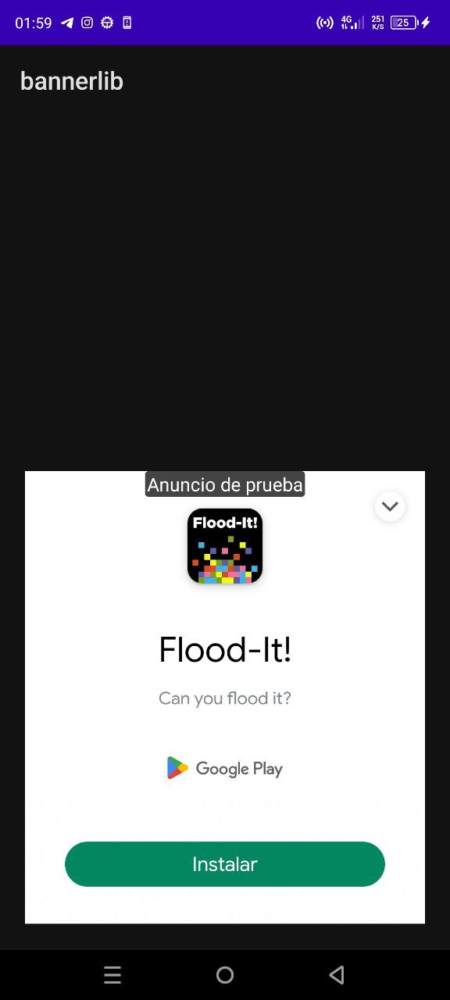
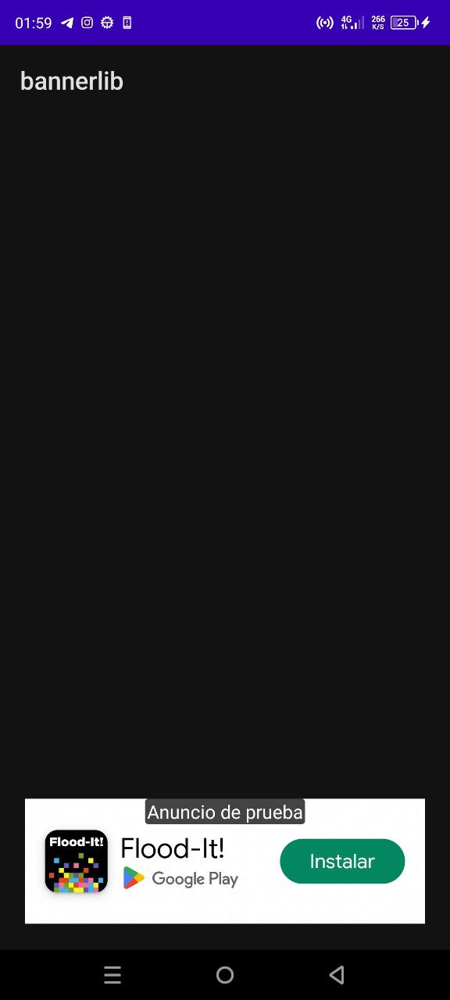

# Expandible-banner-LatamSRC
Repositorio para el code del nuevo banner Echo Por El Mandarin Sniff Para Mis Amigos de LatamSRC

　　　　　　

##PRIMERO Y MAS IMPORTANTE
Primero Agrega Tus Ids En El Manifest Tambien en String ejemplo
```groovy
<string name="admobexpandible">Echo Por LatamSRC</string>
```    
```groovy
 <meta-data
            android:name="com.google.android.gms.version"
            android:value="@integer/google_play_services_version" />

        <meta-data
            android:name="com.google.android.gms.ads.APPLICATION_ID"
            android:value="@string/idads"
            tools:replace="android:value"/>
        <meta-data
            android:name="com.google.android.gms.ads.AD_MANAGER_APP"
            android:value="true" />
```
###PASO 1

####Instala el Gradle

```groovy
dependencies {
	        implementation 'com.github.gatesccn01:Expandible-banner-LatamSRC:1.0.0'

}
```
###Step 2
####Agrega El XML Visual


```xml
    <com.elmandarin.expandiblelatamsrc.loadnewbannerlatamsrc
        android:layout_width="wrap_content"
        android:layout_height="wrap_content"
        android:text="Hello World!"
        app:layout_constraintBottom_toBottomOf="parent"
        app:layout_constraintEnd_toEndOf="parent"
        app:layout_constraintStart_toStartOf="parent"
        app:layout_constraintTop_toTopOf="parent"
        android:gravity="center"
        app:layout_constraintVertical_bias="0.963" />

```
###DISFRUTALO RECUERDA ENVIARME TUS COMENTARIOS PARA MEJORAR
###BY LatamSRC

